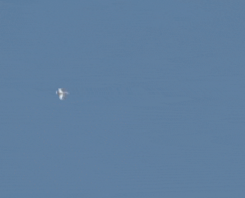
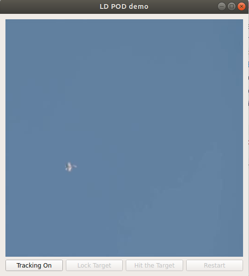
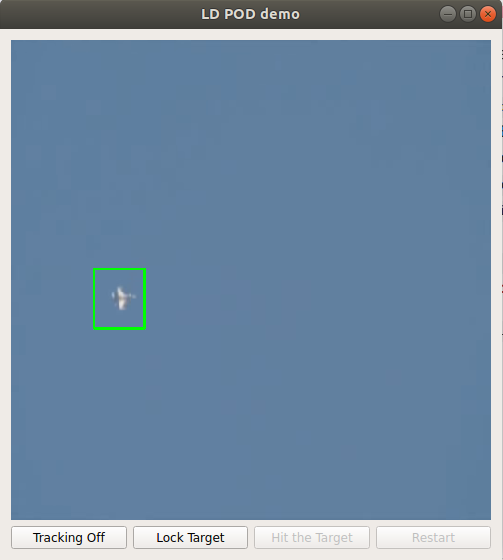
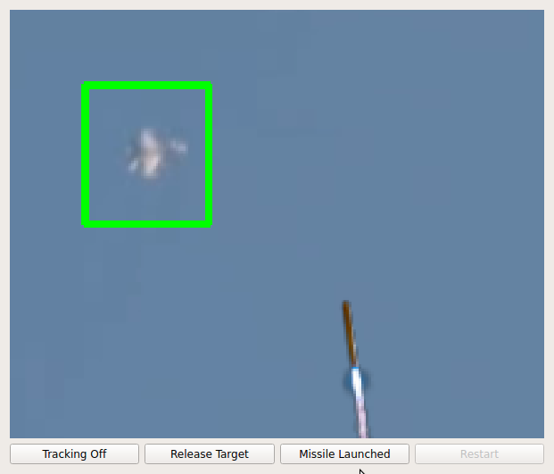

# Laser Designator - POD 
### A Simulation



Video Explanation may be found at:
https://drive.google.com/file/d/1cE0dWYl7W9Wurtht2RqF80bUmHSodXNc/view

### Installation
#### Install Raspbian OS

* Download this specific version of Raspbian: https://downloads.raspberrypi.org/rpd_x86/images/rpd_x86-2019-04-12/.
* You may choose to install another version for Rasbian OS but you may face difficulties installing Qt5 framework for GUI.
* So the Raspbian version mentioned above is the safest option.
* Unless you are able to install Qt5 on another version of Raspbian.  

#### Install Prerequisits
* Update Libraries: ```sudo apt update```
* Upgrade Libraries: ```sudo apt upgrade```
* Install Qt5: ```sudo apt-get install qt5-default```

#### Create the Python Environment

* Create Virtual Environment: ```python3 -m venv ld-pod-env``` 
* Activate Environment: ```source ~/ld-pod-env/bin/activate```
* Upgrade PIP: ```pip install --upgrade pip```
* Install PyQt:```pip install -r requirements.txt```

### Usage
* Download the Source Code: ```git clone https://github.com/shehzi-khan/ld-pod.git```
* Move to the source directory: ```cd ld-pod```
* Run the python code: ```python main.py```

#### Main Screen
The first screen you will see, looks like this.
 
 
 
 In this screen you will see the video of a plane, flying in a sky. 
 Below that video, you will see some controls e.g.
 * Tracking On/Tracking Off
 * Lock Target
 * Hit the Target
 * Restart
 
 Among all these controls only "Tracking On" button is enabled. Because you may lock the target only after being tracked.
 
 #### Enable Tracking
 Try clicking the "Tracking On" button. The screen will look as follows:
 
 
 
 - Now you may see a green rectangle (we call it the bounding box) around the detected object e.g. Plane.
 - This became possible due to the object detection method we used. 
 - For complex enviroments, e.g. clouds or any place where background is not as simple as blue sky, you may want to replace the object detection code with machine learning or deep learning models.
 - You might have observed that the button "Tracking On" is changed to "Tracking Off". Clicking it will take you back of previous mode with disabled tracking.
 
 #### Enable Locking
 - You may have noticed that another button "Lock Target" has been enabled.
 - Try clicking "Lock Target" button and your screen will look like as followed:
 
  
 
 - Now as you can see that object is locked in a fixed position in the frame.
 - In real application of LD-POD, the camera is able to rotate to a wide range of angles, therefore it follows the object being tracking. In result the object is locked on the camera and it remains in a constant location if the video frame.
 - For simulation purpose, the object is shown in the center of screen by cropping the video frame by a fixed margin around the detected object.
 
 #### Hitting the Target
 - You may have observed that "Hit the Target" button is now enabled. Try clicking it and you will see something like this. 
 
 
 - As you clicked the "Hit the Target" button, you will see an animated missile approaching the target on the screen.
 - In real world, the Laser designator then uses laser to designate the target and then missile is launched that follows the laser pointer to hit the target.
 - As the object moves further, the missile may change the trajectory to meet the target at a common point.
 - For simluation purposes, the trajectory of missile is computed in form of continuous change in size, angle and location of missile on screen.
 - Once missile is launched, current location, size and angle for each frame is selected from the lists representing the trajectory.
 - In future, you may change the way trajectory is computed to improve animation.
 
 #### Hit Successful
 - Once the missile reaches the target, the screen will look as followed:
 
 
 - Once the missile hits the target, the target will stop moving anymore.
 - A blast will appear, a the target's location.
 
 #### Restart 
 - Since it's all a simulation, you may restart the video using button "Restart" and it will take you to the first screen.
 
 